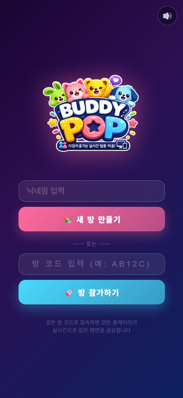
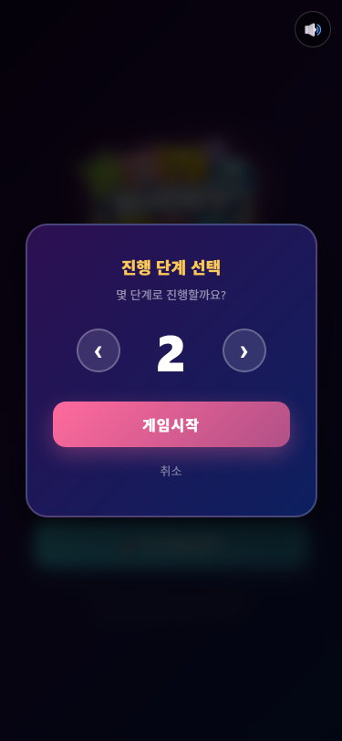
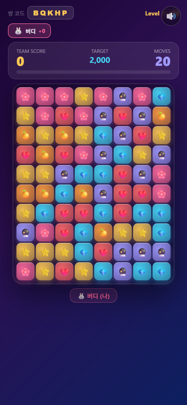
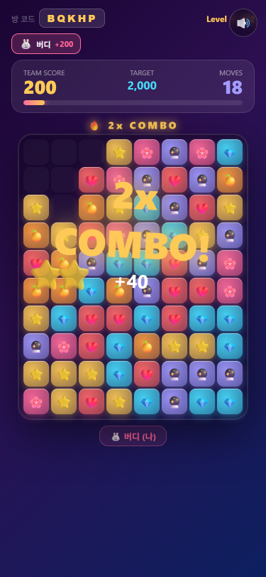
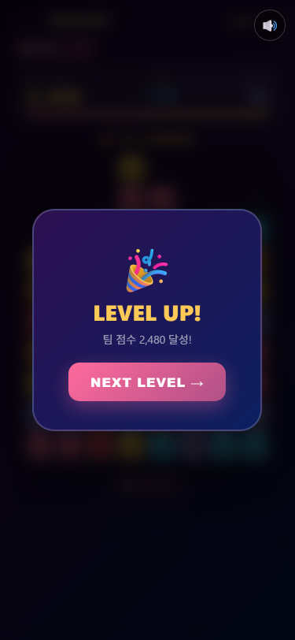

# 🧸 BUDDY POP

> 친구들이 함께 즐기는 **실시간 협동 컬러팝(Match‑Pop) 퍼즐 게임**
> 같은 방 코드로 접속하면 모든 플레이어가 하나의 보드를 실시간으로 공유합니다.

### 🎮 지금 바로 플레이

**▶️ <https://buddypop-app.vercel.app/>**

> 위 링크에 접속해 닉네임을 정하고 새 방을 만든 뒤, 발급된 **방 코드**를 친구에게 공유하면 함께 즐길 수 있습니다.

---

## 🛠 기술 스택

| 분류 | 사용 기술 | 비고 |
|------|-----------|------|
| **프레임워크** | [React 19.2](https://react.dev) | 함수형 컴포넌트 + Hooks (`useState`, `useEffect`, `useCallback`, `useRef`, `memo`) |
| **빌드 도구** | [Vite 8](https://vite.dev) | `@vitejs/plugin-react` 기반 초고속 dev 서버 / 번들링 |
| **백엔드 / 실시간** | [Supabase](https://supabase.com) (`@supabase/supabase-js` 2.x) | `game_rooms` 테이블에 방 상태 저장. **Realtime(WebSocket / Postgres Changes)** 구독을 주 채널로 멀티플레이 동기화, **REST(PostgREST) 800ms 폴링**을 폴백으로 이중화 |
| **상태 관리** | React 로컬 상태 | 별도 상태 라이브러리 없음. 서버 상태를 `mergeRemoteRoom`으로 로컬에 병합 |
| **스타일링** | 인라인 스타일 + 글로벌 `<style>` | CSS 프레임워크 미사용, 그라데이션·블러·애니메이션 직접 구현 |
| **사운드** | HTML5 Audio API | 효과음(클릭·팝·콤보·레벨업 등) + 배경음악 (`src/sound.js`) |
| **품질 도구** | ESLint 10 (`react-hooks`, `react-refresh`) | |
| **배포 대상** | Vercel (정적 SPA) | 환경변수로 Supabase 키 주입 |

### 핵심 설계 포인트
- **렌더링 최적화**: 각 셀을 `memo` 처리해 색상/흔들림이 바뀐 칸만 리렌더.
- **연결 탐색**: 같은 색 블록을 스택 기반 **플러드 필(flood fill)**로 탐색 (재귀 비용 제거).
- **실시간 동기화**: 한 플레이어의 행동을 REST `PATCH`로 DB에 기록하면, 그 변경이 **Supabase Realtime(WebSocket)** 으로 다른 플레이어에게 즉시 푸시됨. Realtime 미설정/오류 시에도 **800ms REST 폴링**이 동작해 동기화를 보장.

### 🤖 개발에 사용한 AI
- **[Claude Code](https://claude.com/claude-code)** — Anthropic의 에이전트형 코딩 도구
- **[Cursor](https://cursor.com)** — AI 코드 에디터

---

## 🎮 게임 소개

**BUDDY POP**은 8×10 보드에서 **같은 색 블록 2개 이상이 연결된 묶음을 터뜨려** 목표 점수를 달성하는 퍼즐 게임입니다.
혼자서도, 친구와 함께 같은 방에서도 즐길 수 있습니다.

### 규칙 한눈에 보기
- **보드**: 8칸 × 10칸, 6가지 색상 (🌸 🍊 ⭐ 💎 ❤️ 🔮)
- **터뜨리기**: 같은 색이 2개 이상 인접하면 클릭으로 제거 → 위 블록이 아래로 떨어짐(중력)
- **점수**: `연결된 블록 수 × 연결된 블록 수 × 10` — 한 번에 많이 터뜨릴수록 점수 급상승
- **콤보**: 연속으로 터뜨리면 콤보 배수가 붙어 점수가 폭발적으로 증가 🔥
- **이동 횟수(MOVES)**: 레벨당 20회. 횟수를 다 쓰기 전에 목표 점수 달성 필요
- **레벨**: 최대 5단계 (목표 2,000 → 4,000 → 6,000 → 8,000 → 10,000)
- **멀티플레이**: 같은 방 코드로 접속한 모두가 하나의 보드를 공유하고 각자 기여 점수가 집계됨

---

## 📸 화면별 진행 흐름

### 1. 로비 (첫 화면)
닉네임을 입력한 뒤 **새 방을 만들거나**, 친구가 알려준 **방 코드로 참가**합니다.

---

### 2. 진행 단계 선택
새 방을 만들 때 **몇 단계(레벨)까지 진행할지** 선택합니다 (1~5단계).

---

### 3. 게임 시작
방이 생성되면 고유 **방 코드(예: `Y8B95`)**가 발급되고, 8×10 컬러 보드가 펼쳐집니다.
상단에서 **팀 점수 · 목표 점수 · 남은 이동 횟수**를 확인할 수 있습니다.

---

### 4. 게임 진행 — 블록 팝 & 콤보
같은 색 블록 묶음을 터뜨리면 점수가 오르고, 연속으로 터뜨리면 **🔥 COMBO** 이펙트와 함께 배수 점수를 획득합니다.

---

### 5. 레벨 클리어
목표 점수를 달성하면 **LEVEL UP!** 연출이 나타나고, 다음 레벨로 진행합니다.
(마지막 레벨을 클리어하면 🏆 승리, 이동 횟수를 모두 소진하면 😢 게임 오버)

